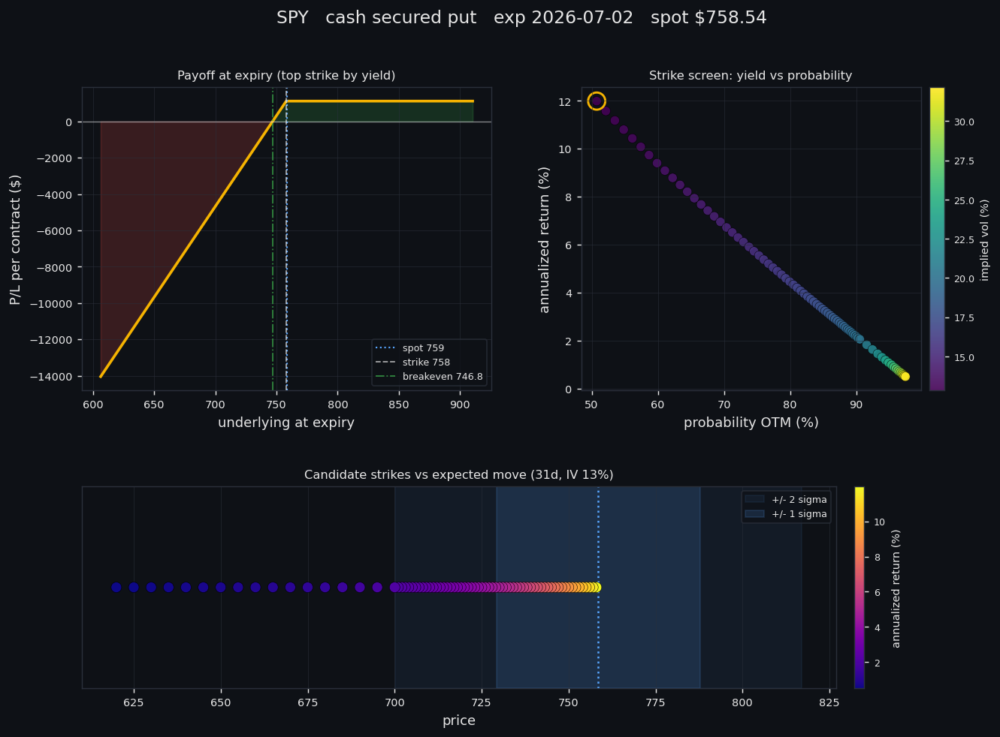

# Options Analyzer Tool

A command-line tool for screening cash secured put and covered call opportunities
using live data from Yahoo Finance. It pulls the options chain for a ticker, ranks
the strikes by annualized premium, and shows the metrics you'd actually look at
before selling premium: probability of staying OTM, days to expiry, implied vs
historical volatility, and expected move. Optional AI commentary via Google Gemini.

This is built for education and screening, not as trading advice. See the disclaimer
at the bottom.

## Features

- Two strategies: cash secured puts and covered calls
- Per-strike metrics: annualized return, premium percent, probability OTM, OTM percent,
  bid/ask, volume, open interest
- Volatility context: ATM implied volatility, 1-year historical volatility, and 7d/30d
  expected move
- Filters to keep the output relevant: only OTM strikes, drops zero-bid options, and
  (when delta is available) keeps strikes roughly in the 0.05-0.40 delta range
- Optional AI write-up of the top opportunities via Google Gemini
- Visual report (`--chart`): payoff diagram, strike screen, and expected-move map

## Visual report

Pass `--chart` to save a one-page visual: the payoff at expiry for the top strike, a
screen of every candidate strike (annualized return vs probability of staying OTM,
coloured by implied volatility), and where those strikes sit against the expected move.



## Installation

1. Clone the repo:
   ```
   git clone https://github.com/hakonstoerholt/options_analyzer_tool.git
   cd options_analyzer_tool
   ```

2. Create and activate a virtual environment (recommended):
   ```
   # macOS / Linux
   python3 -m venv venv
   source venv/bin/activate

   # Windows
   python -m venv venv
   venv\Scripts\activate
   ```

3. Install dependencies:
   ```
   pip install -r requirements.txt
   ```

4. (Optional) Set up a Gemini API key for AI commentary:
   - Create a `.env` file in the project root with `GEMINI_API_KEY=your_api_key_here`,
   - or add `gemini_api_key: your_api_key_here` to `config/settings.yaml`.

   Without a key, run with `--no-ai` and everything else works fine.

## Usage

```
python main.py TICKER [options]
```

Running `python main.py AAPL` screens cash secured puts for Apple using the defaults.

### Options

- `-s`, `--strategy`: Strategy to analyze (`cash_secured_put` or `covered_call`)
- `-d`, `--days`: Maximum days to expiration
- `-p`, `--premium`: Minimum annualized premium percentage to include
- `-e`, `--expiration`: Specific expiration date (YYYY-MM-DD). If it isn't a listed
  expiration the tool falls back to the nearest suitable date within `--days`.
- `--no-ai`: Skip the AI commentary
- `--chart`: Save a visual report (payoff, strike screen, expected move) as a PNG
- `--chart-dir`: Directory for chart images (default: `charts/`)

Defaults for ticker, strategy, days, and premium come from `config/settings.yaml`.

### Examples

Screen covered calls for Tesla with at least 1% annualized premium:
```
python main.py TSLA -s covered_call -p 1.0
```

Screen cash secured puts for SPY at a specific expiration, no AI:
```
python main.py SPY -e 2026-06-19 --no-ai
```

Save the visual report alongside the table:
```
python main.py SPY --no-ai --chart
```

## Configuration

Defaults live in `config/settings.yaml`:

- `min_premium_percent`: minimum annualized premium percentage to include
- `max_days_to_expiry`: maximum days to expiration to consider
- `show_ai_analysis`: whether to run the AI commentary by default
- `default_strategy`: strategy used when `-s` is omitted
- `default_ticker`: ticker used when none is given on the command line

## Notes on the numbers

- Annualized return scales the period premium percent to 252 trading days and is capped
  at 1000% so illiquid or stale quotes don't blow up the ranking.
- Probability OTM uses option delta when it's present in the chain, otherwise it falls
  back to a Black-Scholes style estimate from implied volatility.
- Quotes are whatever Yahoo Finance returns, which can be delayed or thin for less
  liquid names. Treat the output as a starting point, not a fill price.

## Running the tests

```
python -m unittest discover -s tests
```

## License

[MIT](LICENSE)

## Disclaimer

This tool is for educational and informational purposes only. It is not financial
advice. Do your own research and consider your own situation before trading options.
